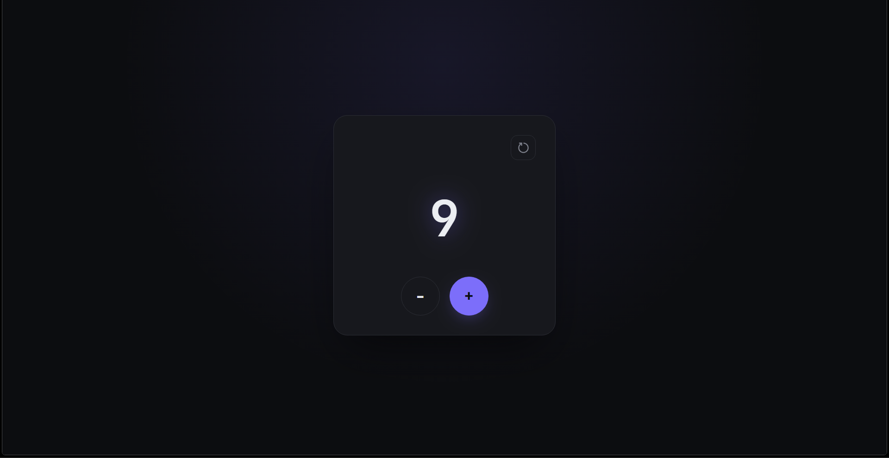

# Counter App

A small React practice project to understand the basics: state, event handlers, and conditional styling.

## Screenshots



## What it does

- Increment / decrement a number
- Reset back to 0

## Concepts practiced

- `useState` for managing the count
- Passing click handlers to buttons
- Basic component structure (JSX + CSS)

## Run

```bash
npm install
npm run dev
```

## Files

- `Counter.jsx` — component logic
